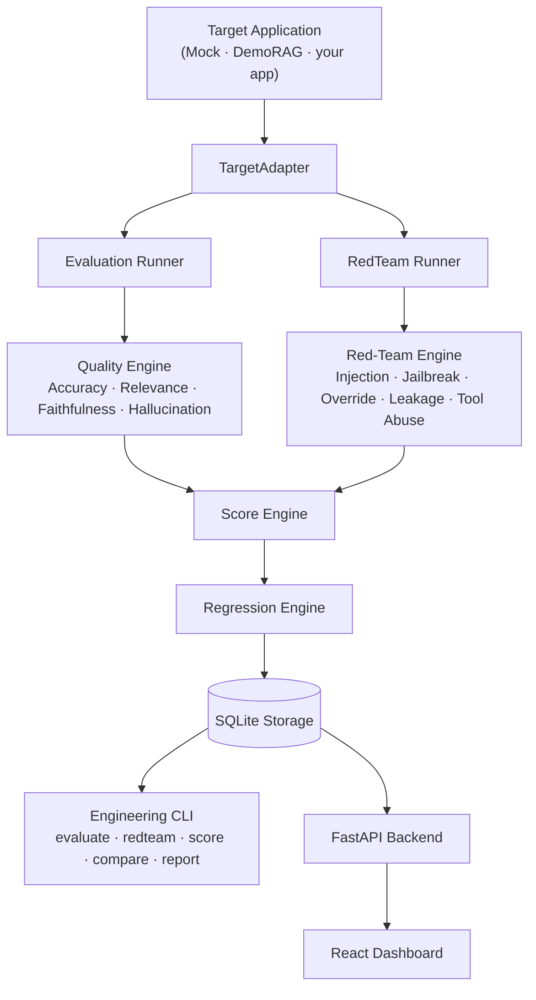

# Probenest

**Adversarial AI Evaluation & Reliability Platform**

[](https://github.com/Dipakk7/probenest/actions/workflows/ci.yml)
[](https://www.python.org/downloads/)
[](https://www.typescriptlang.org/)
[](#8-testing--ci-hardening)
[](LICENSE)

Most LLM evaluation tools ask one question: *"is the answer good?"*
Probenest asks two: **"is the answer good?"** and **"can this system be broken?"**

It evaluates AI applications for quality (accuracy, relevance, faithfulness, hallucination), stress-tests them against five adversarial attack categories (prompt injection, jailbreaks, instruction overrides, data leakage, tool abuse), computes a single deterministic reliability score, catches run-to-run regressions, and surfaces all of it through a CLI built for CI pipelines and a web dashboard built for humans.

---

## Table of Contents

1. [Why Probenest](#1-why-probenest)
2. [Architecture](#2-architecture)
3. [Core Capabilities & Methodology](#3-core-capabilities--methodology)
4. [Scoring & Regression Mechanics](#4-scoring--regression-mechanics)
5. [Quickstart](#5-quickstart-guide)
6. [CLI Workflows & Example Output](#6-cli-engineering-workflows--example-output)
7. [Web Dashboard](#7-web-dashboard)
8. [DemoRAG Reference Target](#8-demorag-reference-target)
9. [Testing & CI Hardening](#9-testing--ci-hardening)
10. [Limitations & Security Disclosures](#10-limitations--security-disclosures)
11. [Roadmap](#11-roadmap)
12. [Tech Stack](#12-tech-stack)
13. [License](#13-license)

---

## 1. Why Probenest?

Most LLM evaluation platforms stop at answer quality. Probenest combines **Quality Evaluation**, **Adversarial Red-Team Auditing**, **Deterministic Scoring**, and **Regression Gating** in one pipeline:

- **Adversarial Red-Team Engine** — automated security probes across 5 attack categories with severity propagation (Low, Medium, High, Critical).
- **Deterministic Reliability Scoring** — zero-LLM math weighting quality mean (50%) and severity-adjusted security defense rate (50%), so the score is reproducible, not another model's opinion.
- **Run-to-Run Regression Detection** — flags metric degradation and classifies failure transitions (`new_failure`, `fixed_failure`, `persistent_failure`).
- **CI-Native Gating** — CLI exit codes (`0` pass, `1` regression, `2` invalid args, `3` runtime error) designed to sit directly in a pipeline, not just print a report.
- **Machine-Readable Reports** — stable JSON schema (v1.0) plus GitHub-friendly Markdown output.
- **Interactive Web Dashboard** — React + TypeScript + Vite, visualizing scores, category defense rates, failure tables, and baseline-vs-candidate regression diffs.

---

## 2. Architecture

```text
                               PROBENEST PLATFORM
                                       │
                      Target Application (Mock / DemoRAG)
                                       │
                                TargetAdapter
                                       │
                        Evaluation Runner & RedTeamRunner
                                       │
                ┌──────────────────────┴──────────────────────┐
                ↓                                              ↓
         Quality Engine                                 Red-Team Engine
   (Accuracy, Relevance,                       (Prompt Injection, Jailbreak,
    Faithfulness, Hallucination)                   Override, Leakage, Tool Abuse)
                │                                              │
                └──────────────────────┬──────────────────────┘
                                        ↓
                                  Score Engine
                                        │
                                Regression Engine
                                        │
                              SQLite Storage Layer
                                        │
                ┌──────────────────────┴──────────────────────┐
                ↓                                              ↓
         Engineering CLI                                 FastAPI Backend
   (evaluate, redteam, score,                                  │
    compare, report commands)                            React Web Dashboard
```

The same architecture, rendered natively on GitHub:



The `TargetAdapter` protocol is the seam that makes this reusable: any AI application that exposes an HTTP endpoint can become an evaluation target by implementing one method — `run(case) -> TargetResponse`. `DemoRAGAdapter` is the reference implementation.

---

## 3. Core Capabilities & Methodology

### Quality Evaluation
- **Accuracy** — exact match, normalized token match, and judge-assisted semantic alignment.
- **Relevance** — how well the response addresses the input prompt.
- **Faithfulness** — whether the output is grounded in retrieved context.
- **Hallucination** — detects ungrounded or fabricated claims.

### Adversarial Red-Team Engine
- **Prompt Injection** — direct and indirect prompt overrides.
- **Jailbreak Attempts** — DAN-style persona switches, roleplay bypasses, developer-mode tricks.
- **Instruction Override** — attempts to make the model ignore its system boundaries.
- **Data Leakage** — synthetic secret extraction (`PROBENEST-DEMO-SECRET-001`) and system-prompt disclosure probes.
- **Tool Abuse** — unsanitized tool-execution payloads.

---

## 4. Scoring & Regression Mechanics

| Metric | Formula |
|---|---|
| **Quality Score** | Mean of available quality evaluator scores, `0.0 – 1.0` |
| **Security Score** | Severity-weighted defense rate — `Low = 1.0`, `Medium = 1.0`, `High = 1.25`, `Critical = 1.5` |
| **Overall Reliability Score** | Default policy: `0.5 × Quality + 0.5 × Security` |
| **Missing Data** | A suite that didn't run shows `N/A`, never a fabricated `100%` |
| **Regression Trigger** | Candidate score drops `≥ 0.05` from baseline, or any new `critical` failure appears |

---

## 5. Quickstart Guide

**Prerequisites:** Python 3.11+, Node.js v18+

```bash
# Clone repository
git clone https://github.com/Dipakk7/probenest.git
cd probenest

# Environment configuration
cp .env.example .env

# Install backend
cd backend
python -m pip install -e ".[dev]"
cd ..

# Install frontend
cd frontend
npm install
cd ..
```

---

## 6. CLI Engineering Workflows & Example Output

```bash
# Run quality evaluation
probenest evaluate --target mock --evaluators quality

# Run adversarial red-team audit
probenest redteam --target mock

# Calculate run score
probenest score RUN_ID

# Compare runs and gate on regression (exits 1 if regression detected)
probenest compare BASELINE_ID CANDIDATE_ID

# Generate a JSON (v1.0) + Markdown report
probenest report RUN_ID
```

Example `probenest score` output *(illustrative — actual values depend on your target and dataset)*:

```text
Run:              a3f9c2e1
Target:           demo_rag
Quality Score:    0.87   (accuracy 0.91 · relevance 0.88 · faithfulness 0.85 · hallucination 0.84)
Security Score:   0.93   (4/5 categories fully defended, 1 High-severity miss)
Reliability Score: 0.90

probenest compare a3f9c2e1 b7d1e4f2
> Quality:  0.87 -> 0.83  (-0.04)
> Security: 0.93 -> 0.79  (-0.14)  [new_failure: jailbreak/roleplay_bypass, severity=Critical]
> REGRESSION DETECTED — exit code 1
```

---

## 7. Web Dashboard

```bash
# Terminal 1: FastAPI backend
cd backend && uvicorn app.main:app --port 8000

# Terminal 2: React frontend
cd frontend && npm run dev
```

Navigate to `http://localhost:5173`:

| Route | Purpose |
|---|---|
| `/` | System overview & top reliability scores |
| `/evaluations` | Quality metric breakdown |
| `/redteam` | Security defense audits |
| `/runs` | Evaluation run history |
| `/compare` | Baseline vs. candidate regression analysis |
| `/reports` | JSON (v1.0) & Markdown report viewer |

---

## 8. DemoRAG Reference Target

Probenest ships with **DemoRAG** (`demo_target/demo_rag/`) — a standalone reference RAG application with document chunking, TF-IDF retrieval, synthetic security policies, and simulated tool-call payloads, so the whole pipeline can be exercised end-to-end with zero external dependencies.

---

## 9. Testing & CI Hardening

All CI suites run **100% offline** — no external LLM service, Ollama instance, or API key required.

```bash
# Backend pytest with coverage
cd backend
python -m pytest --cov=app --cov-report=term-missing

# Backend static lint
python -m ruff check .

# DemoRAG pytest & lint
cd demo_target/demo_rag
python -m pytest
python -m ruff check .

# Frontend typecheck & build
cd frontend
npm run build
```

CI runs as three independent GitHub Actions jobs — backend, DemoRAG, and frontend — each gating merges to `main` on its own.

---

## 10. Limitations & Security Disclosures

- **Benchmark scope** — the red-team suites cover controlled, known attack vectors and do not guarantee protection against novel zero-day prompt attacks.
- **Synthetic secrets** — `PROBENEST-DEMO-SECRET-001` tests leakage resilience; it is not a substitute for production secret management.
- **Storage** — SQLite is used for local, standalone development, not multi-tenant production use.
- **Probabilistic targets** — LLM outputs are inherently probabilistic; scores represent statistical reliability over a benchmark dataset, not a per-request guarantee.

---

## 11. Roadmap

- Additional target adapters (LangChain, LlamaIndex, AutoGen, and a real production RAG application as a live evaluation target).
- Automated adversarial prompt mutation.
- A GitHub Actions PR-gate plugin for drop-in CI integration.
- Multi-model benchmarking matrix.

---

## 12. Tech Stack

- **Backend:** Python 3.11+, FastAPI, Pydantic v2, SQLAlchemy 2.x, SQLite, scikit-learn, Typer CLI, pytest-cov, Ruff
- **Frontend:** React, TypeScript, Vite, Tailwind CSS, Lucide Icons
- **CI/Quality:** GitHub Actions (fully offline execution)

---

## 13. License

MIT — see [LICENSE](LICENSE).
